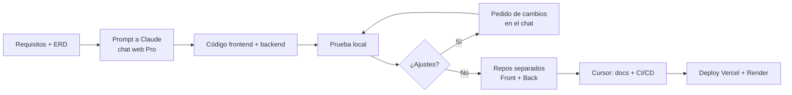

# Informe Técnico — Bitácora de Desarrollo con IA

**Proyecto:** Jill's Sandwich — Sistema de Gestión de Restaurante  
**Asignatura:** Gestión de Desarrollo de Software — TP Integrador  
**Fecha:** Junio 2026  
**Grupo:** [NOMBRE DEL GRUPO]

---

## 1. Resumen del proyecto

Desarrollamos un sistema web full-stack para la administración de un restaurante ficticio ("Jill's Sandwich"). El sistema está compuesto por un **frontend** (panel de administración en React), un **backend** (API REST en FastAPI) y una **base de datos** relacional, y permite gestionar pedidos, clientes, menú, mesas y ventas.

El frontend es una SPA que consume la API REST. Los módulos cubren autenticación, dashboard con KPIs, gestión de pedidos, clientes, menú, mesas y ventas con doble verificación para operaciones sensibles.

### Modelo de datos (ERD)

El diagrama entidad-relación fue diseñado con asistencia de Claude y guía la consistencia entre backend y frontend:


> **Nota:** Guardar la captura del ERD en `docs/erd.png` antes de subir el repo.

**Entidades principales:** `customers`, `tables`, `menu_items`, `orders`, `order_items`, `payments`.

**Repositorios:**
- Frontend: `ProyectoDeGestionDeRestaurante-Front` — [PENDIENTE — URL GitHub]
- Backend: `ProyectoDeGestionDeRestaurante-Back` — [PENDIENTE — URL GitHub]

**Demo en vivo:**
- Frontend: [PENDIENTE — URL Vercel]
- Backend: [PENDIENTE — URL Render/Railway]

**Video demo:** [Primera presentación en YouTube](https://youtu.be/fP-bVC3v1AU)

---

## 2. Nuestro arsenal de herramientas de IA

| Herramienta | Versión / Plan | Uso principal |
|-------------|----------------|---------------|
| **Claude** (chat web) | Pro | Generación del código frontend y backend, diseño del ERD, estructura del proyecto |
| **Cursor** | Agent mode | Documentación, CI/CD, variables de entorno, organización del repositorio |

---

## 3. Sinergia con la IA — Cómo nos ayudó a programar

### 3.1 Generación de código (Claude — chat web Pro)

El prompt inicial fue **intencionalmente sencillo** porque ya existía contexto previo cargado en la conversación sobre el dominio del restaurante. A partir de ahí, pedimos crear **una interfaz web para el administrador** con gestión de pedidos, clientes, menú, mesas y ventas.

**Prompt inicial (reconstruido):**

```
Necesitamos crear una interfaz web para el administrador del restaurante
(panel de gestión de pedidos, clientes, menú, mesas y ventas).
```

**Tareas donde la IA fue más útil:**

- [x] Estructura inicial del proyecto (Vite + React + TypeScript)
- [x] Componentes de UI y modales
- [x] Hooks con React Query
- [x] Integración con la API (axios + interceptores JWT)
- [x] Estilos con Tailwind CSS
- [x] Routing y rutas protegidas
- [x] Consistencia con el modelo de base de datos (ERD)
- [x] Conexiones y contratos con el backend

Claude destacó especialmente en **generar la estructura del proyecto**, **mantener las conexiones con el backend alineadas** y **preservar consistencia con la base de datos** definida en el ERD.

### 3.2 Depuración y ajustes

En el frontend **no hubo errores al probar el código generado de entrada**. El flujo de trabajo consistió en **pedir cambios iterativos** (ajustes de UI, comportamiento, textos) más que en corregir bugs. En ningún caso tuvimos errores al probar el código suministrado por la IA.

Esto sugiere que, cuando el contexto previo es claro (dominio, entidades, flujos), Claude puede generar código funcional a la primera en proyectos de esta escala.

### 3.3 Documentación y despliegue (Cursor)

Cursor intervino en la fase de **entrega del TP**, no en la generación del código base:

- README completo del frontend
- Informe técnico (este documento)
- GitHub Actions (CI/CD)
- Variable `VITE_API_URL` para despliegue
- `vercel.json` para routing SPA
- Corrección de errores de build (imports no usados)

*(Sección 6 completada con la experiencia del grupo.)*

---

## 4. Lecciones aprendidas y desafíos

### 4.1 Lo que funcionó bien

- **Contexto previo en la conversación:** Tener el dominio del restaurante y el modelo de datos ya definidos nos permitió un prompt inicial minimalista pero efectivo.
- **Capacidad abarcativa de Claude:** Cumple órdenes específicas y, al mismo tiempo, **rellena eficientemente los huecos** que los operadores dejan al promptear (tipos, hooks, manejo de errores, estructura de carpetas).
- **Consistencia con el ERD:** Al compartir el modelo de datos, la IA mantuvo coherencia entre frontend, backend y base de datos.
- **Velocidad:** Un proyecto que nos hubiera llevado **~9 horas** manualmente lo completamos en **~1 hora y 30 minutos** con asistencia de IA.

### 4.2 Donde la IA requirió intervención manual

- **Ajustes iterativos de UI/UX:** No fueron correcciones de errores, sino refinamientos pedidos explícitamente (cambios visuales, flujos, textos).
- **Preparación para producción:** URLs hardcodeadas a `localhost`, ausencia de CI/CD y documentación — resueltos posteriormente con Cursor.
- **Despliegue:** Configuración de variables de entorno, CORS y secrets de GitHub/Vercel requieren pasos manuales fuera del alcance del chat.

### 4.3 Desafíos técnicos del proyecto

- Integración frontend-backend con tokens JWT duales (`access_token` + `sales_token` para operaciones de ventas)
- CORS en despliegue con dominios distintos (Vercel + Render/Railway)
- Mantener sincronizados dos repositorios separados con documentación compartida

### 4.4 Reflexión sobre la eficiencia de la IA

Para proyectos **pequeños y medianos**, Claude (incluso en su versión de navegador, sin CLI) demostró ser **altamente eficiente**. La clave fue:

1. Tener el dominio y el modelo de datos claros antes de pedir código
2. Confiar en la capacidad de la IA para completar detalles no explicitados
3. Iterar con pedidos de cambio puntuales en lugar de reescribir desde cero

---

## 5. Flujo de trabajo adoptado



---

## 6. Experiencia con Cursor (documentación y organización)

### 6.1 Tareas realizadas con Cursor

- [x] README completo del proyecto frontend
- [x] Informe técnico (este documento)
- [x] Configuración de GitHub Actions (CI/CD)
- [x] Variables de entorno para despliegue (`VITE_API_URL`)
- [x] `vercel.json` para SPA routing
- [x] Fix de build (imports no usados en TypeScript)
- [ ] Documentación general unificada (front + back) — en progreso
- [ ] README del backend — pendiente

### 6.2 ¿Qué tan útil fue Cursor vs Claude?

No identificamos una herramienta como estrictamente "mejor" que la otra; más bien, según la naturaleza de cada una, definimos con claridad en qué contextos preferimos usar cada una:

| Herramienta | Contexto preferido | Por qué |
|-------------|-------------------|---------|
| **Claude** (chat web) | Empezar un proyecto desde cero | Es nuestro puntapié inicial y ejecutor principal del cuerpo del proyecto. Para generar la base del código a partir de un prompt, no encontramos alternativa más eficiente. |
| **Cursor** (agente en IDE) | Depuración, tareas mecánicas y documentación | Al estar integrado en el editor, puede ver y manipular nuestros archivos y la terminal sin salir del entorno de desarrollo. |

**Ventajas concretas de Cursor que destacamos:**

- **Depuración rápida:** Podemos corregir errores sin cambiar de herramienta ni copiar código entre ventanas.
- **Tareas mecánicas repetitivas:** Operaciones tediosas a mano — como renombrar un archivo y actualizar todos los imports que lo referencian — las resuelve de forma eficiente.
- **Documentación con contexto completo:** Su capacidad de leer todo el proyecto, combinada con el contexto que le suministramos como operadores, lo convierte en una herramienta muy útil para generar documentación de distintos tipos y propósitos.

En resumen: **Claude construye, Cursor mantiene y empaqueta.**

### 6.3 Prompts que funcionaron mejor en Cursor

Los prompts que mejor resultado nos dieron fueron los orientados a **crear documentación** y los de **ir modificándola según lo que necesitábamos** en cada iteración. Pedirle a Cursor que explore el proyecto, arme README e informe técnico, y luego refinar el contenido con correcciones puntuales (por ejemplo, ajustar el tono a trabajo grupal o eliminar referencias irrelevantes) resultó mucho más productivo que intentar redactar toda la documentación manualmente.

---

## 7. Checklist de entrega

| # | Requisito | Estado |
|---|-----------|--------|
| 1 | Repo público en GitHub (front) | ⬜ Pendiente |
| 2 | Repo público en GitHub (back) | ⬜ Pendiente |
| 3 | Pipeline CI/CD (GitHub Actions) | ✅ Configurado (front) |
| 4 | Informe de herramientas de IA | ✅ Redactado |
| 5 | Demo funcional online | ⬜ Pendiente deploy |
| 6 | README de calidad | ✅ Creado (front) |
| 7 | Backend desplegado y conectado | ⬜ Pendiente |
| 8 | Documentación general unificada | ⬜ En progreso |

---

## 8. Conclusión

El TP Integrador demostró que el desarrollo asistido por IA no es solo una herramienta de autocompletado, sino un **multiplicador de productividad real**. Pasar de ~9 horas a ~1.5 horas en un proyecto full-stack funcional es una diferencia concreta y medible para nuestro equipo.

La clave del éxito fue **definir el dominio y el modelo de datos primero**, y luego apoyarnos en la IA generativa para producir código coherente entre frontend, backend y base de datos sin errores en la primera iteración.

Para proyectos futuros, adoptaríamos el mismo flujo: definir requisitos y ERD, usar Claude para la generación rápida del código, y reservar herramientas como Cursor para la fase de **empaquetado profesional** (documentación, CI/CD, despliegue) que la IA generativa no cubre por defecto.

La IA no reemplaza el criterio del equipo de desarrollo, pero elimina la fricción de las tareas repetitivas y nos permite enfocarnos en decisiones de arquitectura y experiencia de usuario.
